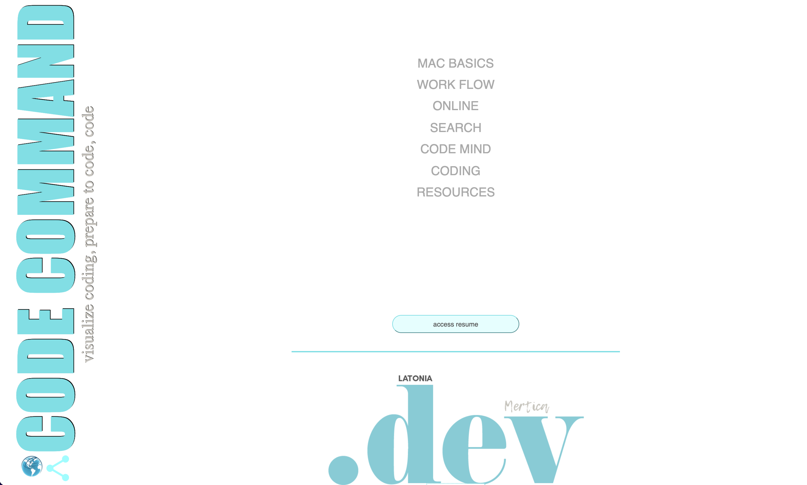

# **CODE COMMAND**

---

##### _visualize coding, prepare to code, code_

##### [visit live demo](https://www.latoniamertica.dev/code-command/#/)

##### [view project teaser](https://drive.google.com/file/d/1WRgbn0Mtz1vQ6o-MDRfigGpqHHg7_3VL/view?usp=sharing)

##### [view testimonial](https://drive.google.com/file/d/1VgzFZXx39FchGUR4GerBWPmvRGPWmY4z/view?usp=sharing)

 

##### _this link goes to content I wish I'd pushed the timeline on to fine tune before submitting_ [view original presentation](https://drive.google.com/file/d/1ouCbomIj7ZLV9FW_0U7pZJD88S2kbCRZ/view?usp=sharing)

 

###### [curriculum overview](public/lessonsContent/curriculumOverview.pdf)

###### [prepare guide](public/lessonsContent/prepare.pdf)

###### [technical questions guide](public/lessonsContent/techQs.pdf)

 

**INTENT**
 
provide a learning tool for beginning coders who want/need to upskill their basic computer literacy through a series of fluid lessons and vibrant resources 

###### [visit trello board](https://trello.com/b/Ehbs3lnX/passion-project)

###### [visit github repo](https://github.com/LaTonia-Mertica/code-command)

 

**REINFORCEMENT**
 

- [Chelsea Troy](https://chelseatroy.com/) | Emergent Works Mentor & Software Engineer 
- [Max Matthews](https://maxmatthe.ws/) | Careers in Code Mentor | Software Engineer 
   

**HOW IT WORKS**
 

- Lessons 

  - pick area(s) of focus 
  - click into focus area 
  - click lesson in focus area 
  - take time/energy to learn 
  - visit focus areas as desired 

 

- Assessments 

  - non-graded to encourage learning 
  - non-linear to encourage repetition 
  - designed to offer basic literacy 
  - soft hard-copy and video options 

 

- Resources 

  - diverse body of hopefully helpful info 
  - not meant to reflect solid standards 
  - meant to reflect possibilities & inspire 

 

**NEXT STEPS**
 

- build solid lessons in each focus area 
- fine tune overall lesson plan and content 
- outline, map, and build self assessment 
- craft step-by-step resource per lesson focus area 
- polish general layout & design to mobile 1st 
- promote/secure position as learning tool to entities 
   

**RESERVATIONS**
 
individuals will view and treat this resource with less-than ideal reception - disregarding or minimizing it's contributions to enhanced computer literacy 
 

 

 

# CREATE REACT APP

This project was bootstrapped with [Create React App](https://github.com/facebook/create-react-app).

## Available Scripts

In the project directory, you can run:

### `npm start`

Runs the app in the development mode.\
Open [http://localhost:3000](http://localhost:3000) to view it in your browser.

The page will reload when you make changes.\
You may also see any lint errors in the console.

### `npm test`

Launches the test runner in the interactive watch mode.\
See the section about [running tests](https://facebook.github.io/create-react-app/docs/running-tests) for more information.

### `npm run build`

Builds the app for production to the `build` folder.\
It correctly bundles React in production mode and optimizes the build for the best performance.

The build is minified and the filenames include the hashes.\
Your app is ready to be deployed!

See the section about [deployment](https://facebook.github.io/create-react-app/docs/deployment) for more information.

### `npm run eject`

**Note: this is a one-way operation. Once you `eject`, you can't go back!**

If you aren't satisfied with the build tool and configuration choices, you can `eject` at any time. This command will remove the single build dependency from your project.

Instead, it will copy all the configuration files and the transitive dependencies (webpack, Babel, ESLint, etc) right into your project so you have full control over them. All of the commands except `eject` will still work, but they will point to the copied scripts so you can tweak them. At this point you're on your own.

You don't have to ever use `eject`. The curated feature set is suitable for small and middle deployments, and you shouldn't feel obligated to use this feature. However we understand that this tool wouldn't be useful if you couldn't customize it when you are ready for it.

## Learn More

You can learn more in the [Create React App documentation](https://facebook.github.io/create-react-app/docs/getting-started).

To learn React, check out the [React documentation](https://reactjs.org/).

### Code Splitting

This section has moved here: [https://facebook.github.io/create-react-app/docs/code-splitting](https://facebook.github.io/create-react-app/docs/code-splitting)

### Analyzing the Bundle Size

This section has moved here: [https://facebook.github.io/create-react-app/docs/analyzing-the-bundle-size](https://facebook.github.io/create-react-app/docs/analyzing-the-bundle-size)

### Making a Progressive Web App

This section has moved here: [https://facebook.github.io/create-react-app/docs/making-a-progressive-web-app](https://facebook.github.io/create-react-app/docs/making-a-progressive-web-app)

### Advanced Configuration

This section has moved here: [https://facebook.github.io/create-react-app/docs/advanced-configuration](https://facebook.github.io/create-react-app/docs/advanced-configuration)

### Deployment

This section has moved here: [https://facebook.github.io/create-react-app/docs/deployment](https://facebook.github.io/create-react-app/docs/deployment)

### `npm run build` fails to minify

This section has moved here: [https://facebook.github.io/create-react-app/docs/troubleshooting#npm-run-build-fails-to-minify](https://facebook.github.io/create-react-app/docs/troubleshooting#npm-run-build-fails-to-minify)
